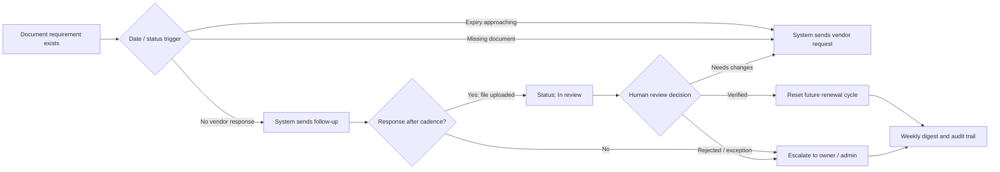
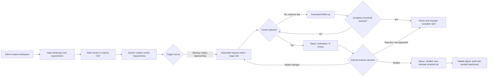
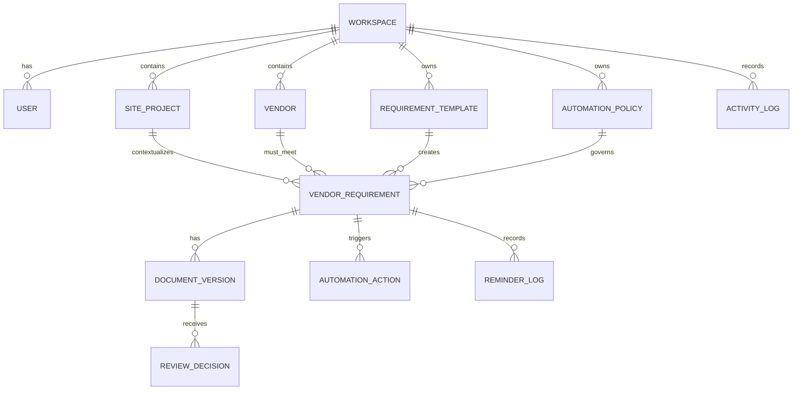

# Workflow: Automated Vendor Document Follow-up & Compliance Workflow

## COI / Vendor Document Tracker — landing page, walidacja, concierge beta i MVP

> **Cel produktu:** automatyzować powtarzalny proces pilnowania, zbierania i domykania dokumentów vendorów — od wykrycia zbliżającego się terminu, przez follow-upy i eskalacje, po ręczne zatwierdzenie oraz ślad audytowy.
>
> **Pozycjonowanie:** _automated vendor-document follow-up and compliance workflow_ — nie zwykły folder na pliki ani system automatycznej oceny prawnej/ubezpieczeniowej.
>
> **Rynek startowy:** małe i średnie zespoły property management, facilities oraz general contractors w USA, Wielkiej Brytanii, Kanadzie i Australii. Wersja 1: angielski interfejs, e-mail jako podstawowy kanał, jedna strefa czasowa na workspace.

---

## 1. Teza produktu: klienci nie kupują trackera, tylko proces działający bez ręcznego pilnowania

### Problem obecnego workflow

W typowym zespole operations lub property management dane o vendorach, dokumentach i terminach są rozproszone:

- daty ważności w Excelu;
- PDF-y w skrzynkach e-mail, Drive lub Dropboxie;
- przypomnienia w prywatnych kalendarzach;
- follow-upy zależne od pamięci jednej osoby;
- brak jednoznacznego ownera, gdy vendor nie odpowiada;
- brak jasnej różnicy między „plik otrzymany” a „plik sprawdzony”.

Konsekwencją nie jest wyłącznie bałagan administracyjny. Wygasły COI, licencja lub permit może opóźnić rozpoczęcie prac, stworzyć ryzyko przy audycie oraz wymusić kosztowne działania w ostatniej chwili.

### Obietnica produktu

> **Your team no longer has to chase expiring vendor documents manually.**

Produkt przejmuje powtarzalne, mechaniczne działania:

1. wykrywa dokumenty wygasające, brakujące lub bez odpowiedzi;
2. wysyła prośbę do właściwej osoby u vendora;
3. ponawia kontakt zgodnie z ustaloną sekwencją;
4. zatrzymuje follow-up, gdy vendor prześle dokument;
5. przekazuje dokument do ręcznego review;
6. eskaluje tylko wyjątki wymagające interwencji człowieka;
7. buduje historię „kto, co i kiedy zrobił”.

### Wąski klin wejścia

**„Automate vendor-document follow-ups before expired paperwork blocks work.”**

Pierwsza wersja nie próbuje być pełnym systemem compliance. Sprzedaje jedno konkretne usprawnienie: zespół przestaje ręcznie pamiętać o terminach i pisać te same wiadomości do vendorów.

### Czego produkt nie robi w MVP

- nie zastępuje brokera, prawnika, underwritera ani compliance officera;
- nie wydaje automatycznej decyzji, że COI lub polisa spełnia warunki umowy;
- nie blokuje vendora automatycznie bez reguły i możliwości decyzji użytkownika;
- nie interpretuje limitów, endorsements lub zakresu coverage;
- nie jest systemem contract lifecycle management, ERP ani marketplace’em vendorów;
- nie wymaga od vendora zakładania konta.

**Zasada bezpieczeństwa:** automatyzuj wykrywanie, komunikację, przypomnienia, routing i eskalacje. Ocena merytoryczna dokumentu oraz finalna decyzja pozostają po stronie uprawnionego użytkownika.

---

## 2. Idealny klient i Jobs to Be Done

### ICP na start

| Element     | Definicja                                                                                      |
| ----------- | ---------------------------------------------------------------------------------------------- |
| Typ firmy   | Property management, facilities management albo mały general contractor                        |
| Wielkość    | 3–50 pracowników; 25–250 aktywnych vendorów lub subcontractorów                                |
| Proces dziś | Excel + e-mail + wspólny dysk + ręczne reminders                                               |
| Buyer       | Operations manager, property manager, office manager, compliance coordinator, owner            |
| Użytkownicy | Project coordinators, administratorzy, managerowie oraz vendorzy korzystający z linków uploadu |
| Sygnał bólu | Wygasły dokument, opóźnione prace, audit scramble, zatrudnienie osoby do ścigania vendorów     |

### Persona 1 — Olivia, Property Operations Manager

- zarządza kilkoma obiektami i wieloma dostawcami;
- chce zobaczyć w 30 sekund: kto może blokować pracę i kto nie odpowiedział;
- chce systemu, który wykonuje follow-upy bez jej codziennego udziału.

### Persona 2 — Marcus, Project Coordinator w małym GC

- potrzebuje kompletnej listy dokumentów przed mobilizacją subcontractora;
- nie chce ręcznie przepisywać statusów z e-maila do arkusza;
- potrzebuje eskalacji, gdy termin jest blisko, a vendor milczy.

### Persona 3 — Vendor

- nie chce loginu, onboardingu ani uczenia się systemu;
- ma dostać jasną prośbę: jaki dokument, do kiedy, gdzie kliknąć;
- powinien po uploadzie wiedzieć, że plik został przyjęty do review, a nie automatycznie zaakceptowany.

### Jobs to Be Done

| Sytuacja                   | Job użytkownika                                                       | Wartość automatyzacji                                  |
| -------------------------- | --------------------------------------------------------------------- | ------------------------------------------------------ |
| Termin zbliża się do końca | „Pilnuj terminów i odezwij się do vendora zanim będzie problem.”      | Follow-up nie zależy od pamięci człowieka              |
| Vendor nie odpowiada       | „Ponów prośbę i pokaż mi dopiero wyjątek.”                            | Zespół nie śledzi ręcznie każdej wiadomości            |
| Dokument wpada do skrzynki | „Zbierz plik w jednym miejscu i przypisz go do właściwego wymagania.” | Brak ręcznego przeklejania danych z e-maila            |
| Dokument wymaga oceny      | „Daj mi kolejkę review, a nie kolejną listę w Excelu.”                | Człowiek skupia się na decyzjach, nie na administracji |
| Manager pyta o status      | „Pokaż co blokuje pracę i kto jest ownerem.”                          | Szybka decyzja bez przeszukiwania folderów             |
| Audyt lub incident review  | „Pokaż historię kontaktu, plików i decyzji.”                          | Jedno źródło prawdy oraz eksportowalny ślad            |

---

## 3. Automatyzowany proces docelowy

### Główny loop produktu



### Co dokładnie jest automatyczne, a co nie

| Etap              | Automatyzacja systemu                                         | Decyzja człowieka                                   |
| ----------------- | ------------------------------------------------------------- | --------------------------------------------------- |
| Wykrycie ryzyka   | obliczenie expiry, overdue, missing, brak odpowiedzi          | ustawienie wyjątkowych reguł dla vendora/projektu   |
| Prośba do vendora | wygenerowanie e-maila, secure upload link, deadline           | zatwierdzenie szablonu i cadence                    |
| Ponowienia        | follow-up po określonej liczbie dni; zatrzymanie po uploadzie | ręczne wstrzymanie sekwencji w nietypowym przypadku |
| Routing           | przypisanie do ownera i kolejki review                        | zmiana ownera, delegacja lub override               |
| Eskalacja         | alert do managera/admina po spełnieniu reguły                 | podjęcie działania biznesowego wobec vendora        |
| Review dokumentu  | utworzenie kolejki, zapis historii, opcjonalna sugestia daty  | finalne `Verified`, `Needs changes`, `Rejected`     |
| Raportowanie      | digest, lista blockerów, eksport                              | interpretacja ryzyka i decyzja operacyjna           |

### Najważniejsza reguła statusu

**`Received` / `Submitted` nie oznacza `Verified`.**

System może automatycznie uznać, że plik wpłynął i zatrzymać follow-up do vendora. Tylko użytkownik wewnętrzny może uznać, że dokument przeszedł review. To chroni przed fałszywym poczuciem zgodności i zachowuje audytowalność.

---

## 4. Walidacja przed budową: sprawdź automatyzację, nie zainteresowanie dashboardem

### Hipotezy do sprawdzenia

1. Problem jest cykliczny: vendor documents wygasają lub są zbierane wielokrotnie, nie jednorazowo.
2. Klienci chcą automatycznego follow-upu i eskalacji bardziej niż kolejnego rejestru plików.
3. Zespół zgodzi się, aby system sam wysyłał vendorom sekwencję e-maili w ramach zatwierdzonych reguł.
4. Vendorzy chętnie korzystają z magic linków bez konta.
5. Buyer zapłaci za oszczędność czasu i mniejsze ryzyko jeszcze przed integracjami branżowymi.
6. Finalne review musi pozostać manualne; pełna automatyczna weryfikacja nie jest konieczna do pierwszej płatnej wersji.

### Sekwencja walidacyjna — 21 dni

| Dni   | Działanie                                | Artefakt                       | Sukces                                              |
| ----- | ---------------------------------------- | ------------------------------ | --------------------------------------------------- |
| 1–3   | Landing page z automatyzacyjną obietnicą | 1 strona, formularz, calendar  | zdarzenia są mierzone                               |
| 1–10  | 20–30 rozmów discovery                   | notatki + mapa procesu         | min. 8 osób opisuje regularne ręczne follow-upy     |
| 4–14  | Outbound do 100–150 kontaktów            | sekwencja e-mail / LinkedIn    | rozmowy z buyerami, nie same kliknięcia             |
| 8–18  | Concierge pilot z 3–5 zespołami          | ręczne/półautomatyczne cadence | pilot używa prawdziwych vendorów i terminów         |
| 15–21 | Oferta paid beta                         | payment link / faktura         | min. 2–3 buyerów chce płacić za automatyzację teraz |

### Pytania walidujące wartość automatyzacji

- Ile godzin tygodniowo zespół spędza na przypomnieniach i szukaniu plików?
- Jak często musicie ponawiać prośbę do jednego vendora?
- Co dziś uruchamia follow-up: termin w Excelu, mail od managera czy problem na site?
- Czy dopuścilibyście automatyczne e-maile do vendorów, jeśli wcześniej zatwierdzicie treść i cadence?
- Kiedy follow-up powinien przestać być automatyczny i trafić do człowieka?
- Kto powinien dostać eskalację, jeśli vendor nie odpowie po trzech prośbach?
- Co jest droższe: jedna osoba przypominająca wszystkim czy jedno opóźnienie prac?

### Minimalny wynik uzasadniający MVP

Buduj dalej, gdy wystąpią łącznie:

- minimum 15 wartościowych rozmów;
- minimum 8 osób opisuje regularny, ręczny loop follow-upów;
- minimum 5 osób chce zobaczyć automatyczną sekwencję na własnym workflow;
- minimum 3 zespoły przekażą przykładowy CSV oraz zgodzą się na concierge pilot;
- minimum 2 buyerów akceptuje testową cenę bez warunku „wróćcie, gdy wszystko będzie gotowe”.

### Sygnały zmiany kierunku

- klienci mają problem wyłącznie z merytoryczną interpretacją polis, nie z procesem;
- wymagają od początku pełnej usługi brokerskiej;
- nie chcą, aby system wysyłał automatyczne follow-upy nawet po akceptacji szablonów;
- typowy portfolio ma tak mało vendorów, że koszt ręcznej pracy jest znikomy;
- obecne narzędzie już automatyzuje follow-up wystarczająco dobrze.

---

## 5. Landing page do smoke testu

### Cel strony

Landing page ma walidować, czy buyer chce **oddać powtarzalny follow-up systemowi**, a nie tylko otrzymać ładniejszą listę PDF-ów.

Mierzone konwersje:

1. zapis na early access;
2. rezerwacja discovery call;
3. pobranie template’u;
4. odpowiedź na pytanie kwalifikujące;
5. zgoda na 30-dniowy pilot z realnymi danymi.

### Wariant A — property management

**Hero**

> **Stop manually chasing vendors for expiring documents.**  
> Automate COI, license, and compliance-document follow-ups — then review only the exceptions that need your attention.

**Subheadline**

> Built for small property teams that still run vendor compliance through spreadsheets, inboxes, and last-minute reminders.

**Primary CTA:** `Apply for an automation pilot`  
**Secondary CTA:** `See the 3-minute workflow`

### Wariant B — general contractors

**Hero**

> **Automate vendor-document follow-ups before expired paperwork blocks work.**  
> Keep COIs, licenses, and subcontractor documents moving without manually sending every reminder.

**Subheadline**

> A lightweight compliance workflow for small contractors who need to know what is missing, what is in review, and what is blocking mobilization.

**Primary CTA:** `Request a pilot`  
**Secondary CTA:** `Get the vendor-document checklist`

### Struktura strony

1. Hero z obietnicą automatyzacji i CTA.
2. Problem visual: Excel + inbox + calendar + ręczne chasowanie.
3. Sekcja „What the system automates”.
4. Przepływ w trzech krokach.
5. Wideo / prototyp pokazujący od triggera do eskalacji.
6. Rezultaty biznesowe i prosty kalkulator oszczędności czasu.
7. Oferta concierge beta.
8. FAQ o kontroli, bezpieczeństwie i decyzjach manualnych.
9. Formularz + calendar.

### Sekcja problemu

**Headline**

> Your team should not have to remember every expiry date and send every follow-up manually.

**Copy**

> A spreadsheet might tell you what expires. It does not send the right request, stop chasing when a file arrives, route the document to review, or escalate the exceptions that can delay work.

### Sekcja automatyzacji

**Headline**

> The routine work runs automatically. Your team reviews the decisions that matter.

| Krok         | Copy                                                                             |
| ------------ | -------------------------------------------------------------------------------- |
| 1. Detect    | We flag missing, expiring, overdue, and unanswered document requirements.        |
| 2. Follow up | We send approved requests and reminders with a secure vendor upload link.        |
| 3. Escalate  | We stop the sequence on upload and surface only overdue or high-risk exceptions. |

### Sekcja korzyści

**Headline**

> Less chasing. Fewer missed expirations. Clearer accountability.

- **Automated cadence** — follow-ups at 90/60/30/7 days, plus configurable overdue rules.
- **Exception-first dashboard** — show only what needs attention now.
- **No-login upload links** — vendors can send documents in under a minute.
- **Human review where it matters** — uploaded is not the same as approved.
- **Escalation rules** — notify the owner, then the manager when a deadline is at risk.
- **Audit-ready history** — every request, file, decision and escalation is recorded.

### Sekcja rezultatów

**Headline**

> Turn a fragile spreadsheet process into a dependable operating routine.

**Copy**

> The product is designed to reduce manual reminders, shorten the time from request to document receipt, and make overdue exceptions visible before they become a site problem.

**Kalkulator ROI na landing page — wersja prosta**

- liczba aktywnych vendorów;
- średnia liczba dokumentów na vendora;
- średnia liczba follow-upów na dokument;
- czas jednego follow-upu w minutach;
- opcjonalnie: wewnętrzny koszt roboczogodziny.

**Wynik:** estymowana liczba godzin administracyjnych do odzyskania miesięcznie. Nie obiecuj gwarantowanych oszczędności — pokazuj założenia użytkownika.

### Sekcja beta

**Headline**

> We are onboarding a small number of automation pilots.

**Copy**

> Bring your current spreadsheet. We will import your vendor list, configure your reminder rules, and run one real follow-up workflow with your team. You keep full control over templates, escalation logic, and final review decisions.

**CTA:** `Apply for a pilot`

### FAQ

**Will the app send emails to vendors automatically?**  
Yes — only according to reminder rules and templates approved by your team. You can pause a sequence or require manual approval for selected vendors.

**Does the app automatically approve insurance certificates?**  
No. It automates collection, routing, reminders and record-keeping. Your team makes the final verification decision.

**Can a vendor upload without an account?**  
Yes. Each request includes a secure upload link scoped to the specific vendor and documents requested.

**What happens when a vendor does not respond?**  
The system follows the configured cadence, then escalates the exception to the owner or manager instead of continuing indefinitely.

**Can we track documents beyond COIs?**  
Yes. The first version supports licenses, permits, W-9 forms, safety certificates, bonds and other document types your team defines.

**Can we start with one building or project?**  
Yes. The workflow is designed to begin with one operational unit and expand later.

### Formularz zapisu

Pola konieczne:

- work email;
- first name;
- company;
- role;
- company type: `Property management / General contractor / Facilities / Other`;
- active vendors: `1–25 / 26–100 / 101–250 / 250+`;
- current process: `Spreadsheet / Shared drive / Existing software / Other`;
- jedno pytanie kwalifikujące: `How many follow-up emails does your team send in a typical month?`;
- opcjonalnie: `What breaks most often today?`.

### Automatyczna sekwencja e-mail po zapisie

| Moment      | Cel                             | Temat                                                              |
| ----------- | ------------------------------- | ------------------------------------------------------------------ |
| Natychmiast | potwierdzenie + CTA do calendar | `Could we map one vendor-document workflow?`                       |
| +1 dzień    | discovery procesu               | `How does your team decide when to follow up?`                     |
| +3 dni      | pokazanie automatyzacji         | `A simple escalation rule for unanswered vendor requests`          |
| +6 dni      | oferta concierge                | `Would you test an automated follow-up cadence with real vendors?` |
| +10 dni     | zamknięcie pętli                | `Should I close your pilot request?`                               |

### A/B test: zmieniaj tylko jedną zmienną

| Test           | Wariant A                  | Wariant B                 | Sukces                       |
| -------------- | -------------------------- | ------------------------- | ---------------------------- |
| Segment        | Property teams             | Contractors               | więcej kwalifikowanych calls |
| Hero           | Stop manual chasing        | Prevent blocked work      | więcej pilot applications    |
| CTA            | Apply for automation pilot | Request a pilot           | więcej booked calls          |
| Dowód wartości | Hours saved                | Exceptions prevented      | wyższa konwersja do rozmowy  |
| Lead magnet    | Vendor follow-up cadence   | Vendor document checklist | lepsza jakość leadów         |

---

## 6. Concierge beta: przetestuj automatyzację zanim ją zbudujesz

### Oferta beta

- maksymalnie 5 zespołów;
- 30 dni pracy na realnych danych;
- import CSV wykonywany przez foundera;
- konfiguracja jednego standardowego workflow dokumentowego;
- zatwierdzone przez klienta template’y wiadomości;
- ręcznie lub półautomatycznie realizowana cadence;
- cotygodniowy review wyjątków;
- preferencyjna płatna cena founders plan.

### Concierge workflow

1. Klient wysyła obecny tracker CSV i 10–30 reprezentatywnych vendorów.
2. Founder normalizuje dane: vendor, contact, site/project, document type, expiry date, owner.
3. Klient zatwierdza document requirements, risk levels, e-mail templates i escalation path.
4. Uruchamiana jest sekwencja: request → follow-up → follow-up → escalation.
5. Vendorzy przesyłają dokument przez prosty link lub odpowiadają e-mailem; founder ręcznie przypisuje pliki do recordów, jeśli trzeba.
6. Klient dostaje weekly digest: co zostało domknięte automatycznie, co wymaga review, co wymaga decyzji managera.
7. Każdy manualny krok jest rejestrowany jako kandydat do automatyzacji MVP.

### Co mierzyć podczas pilota

| Metryka                                            | Dlaczego jest ważna                 |
| -------------------------------------------------- | ----------------------------------- |
| liczba aktywnych vendor requirements               | bazowy wolumen procesu              |
| liczba follow-upów na requirement                  | siła bólu i potencjał automatyzacji |
| czas od request do uploadu                         | mierzy skuteczność cadence          |
| % document uploads bez ręcznego przypomnienia      | jakość pierwszej prośby             |
| % requirements zamkniętych przez automatyczny loop | główna wartość produktu             |
| liczba eskalacji                                   | ile wyjątków wymaga człowieka       |
| czas manualnej pracy przed/po                      | potencjał ROI                       |
| liczba błędów statusu                              | projektowanie modelu danych i UX    |
| decyzje, których klient nie odda automatyzacji     | granice produktu                    |
| willingness to pay po 30 dniach                    | prawdziwy sygnał wartości           |

---

## 7. Workflow produktu MVP

### Happy path: od expiry triggera do kolejnego cyklu



### State machine dla requirementu

| Status          | Kto ustawia             | Co uruchamia                            | Co blokuje                              |
| --------------- | ----------------------- | --------------------------------------- | --------------------------------------- |
| `Not requested` | system / internal user  | utworzenie requirementu                 | brak wysyłki do vendora                 |
| `Requested`     | system / internal user  | pierwsza prośba                         | aktywna cadence follow-upów             |
| `Follow-up due` | system                  | minął termin kolejnego kontaktu         | kolejny e-mail lub manual hold          |
| `Escalated`     | system                  | brak odpowiedzi po zdefiniowanej regule | wymaga decyzji ownera/admina            |
| `Submitted`     | vendor / internal user  | upload pliku                            | zatrzymuje automatyczne follow-upy      |
| `In review`     | system / reviewer       | dokument trafia do kolejki              | czeka na decyzję                        |
| `Verified`      | tylko internal reviewer | finalna akceptacja                      | tworzy kolejny cycle według expiry date |
| `Needs changes` | internal reviewer       | plik nie spełnia wymagania operacyjnego | nowa prośba do vendora                  |
| `Expired`       | system                  | date expiry jest w przeszłości          | może uruchomić risk / blocking alert    |
| `Not required`  | internal user           | wyjątek biznesowy                       | wyłącza cadence                         |
| `Archived`      | internal user           | vendor/projekt nieaktywny               | wyłącza wszystkie automatyzacje         |

### Workflow dokumentu wygasłego

1. `Expiry scanner` oblicza status zgodnie ze strefą czasową workspace’u.
2. Requirement przechodzi do `Expired` albo `Expiry approaching`.
3. System sprawdza policy: czy ma wysłać wiadomość automatycznie, czy utworzyć draft do zatwierdzenia.
4. Jeśli auto-send jest włączony, vendor otrzymuje secure upload link.
5. Jeśli brak odpowiedzi, dispatcher uruchamia kolejne follow-upy w ustawionej cadence.
6. Po ostatnim follow-upie system oznacza record jako `Escalated` i powiadamia ownera, następnie managera.
7. Po uploadzie system zatrzymuje follow-upy; stary dokument pozostaje w historii, nowy trafia do review.
8. Tylko reviewer może ustawić `Verified` albo `Needs changes`.

---

## 8. Reguły automatyzacji i eskalacji

### Principle: automatyzacja musi być przewidywalna, wyjaśnialna i odwracalna

Każda automatyczna akcja ma pokazywać:

- **dlaczego** została uruchomiona;
- **która reguła** ją wywołała;
- **do kogo** została wysłana;
- **co system zrobi dalej**, jeśli nie będzie odpowiedzi;
- **jak zatrzymać lub zmienić** sekwencję.

### Domyślna cadence dla dokumentu z datą ważności

| Trigger             | Akcja systemu                  | Odbiorca                | Warunek stopu                       |
| ------------------- | ------------------------------ | ----------------------- | ----------------------------------- |
| 90 dni przed expiry | pierwsze przypomnienie         | vendor contact          | upload, manual hold, archive        |
| 60 dni przed expiry | follow-up #1                   | vendor contact          | jw.                                 |
| 30 dni przed expiry | follow-up #2 + owner FYI       | vendor + internal owner | jw.                                 |
| 7 dni przed expiry  | urgent follow-up + owner alert | vendor + owner          | jw.                                 |
| expiry date         | expired alert + request        | vendor + owner          | nowy upload lub manual override     |
| 7 dni po expiry     | escalation #1                  | owner + manager         | owner resolves / changes policy     |
| 14 dni po expiry    | escalation #2 / blocker digest | admin / manager         | requirement is resolved or archived |

### Domyślna cadence dla brakującego dokumentu bez expiry date

| Trigger               | Akcja systemu                                |
| --------------------- | -------------------------------------------- |
| requirement utworzony | request z terminem podanym przez użytkownika |
| 3 dni po request      | follow-up #1                                 |
| 7 dni po request      | follow-up #2 + owner FYI                     |
| 14 dni po request     | escalation do ownera                         |
| 21 dni po request     | manager digest / blocking flag według policy |

### Typy automatyzacji w MVP

1. **Expiry automation** — wykrywanie zbliżającego się terminu oraz expired status.
2. **Follow-up automation** — wysyłka requestów i przypomnień.
3. **Stop automation** — automatyczne zatrzymanie sekwencji po uploadzie, archiwizacji lub manual hold.
4. **Review routing** — przypisanie nowo przesłanego dokumentu do kolejki odpowiedniego ownera.
5. **Escalation automation** — alerty po przekroczeniu ustalonych progów.
6. **Digest automation** — tygodniowe zestawienie exceptions zamiast powiadomień o wszystkim.
7. **Data hygiene automation** — alerty o requirementach bez ownera, vendorach bez kontaktu e-mail czy dokumentach bez daty.

### Reguły ochronne

- nigdy nie wysyłaj więcej niż jednej wiadomości do tego samego requirementu w danym dniu;
- nie wysyłaj follow-upu, gdy status to `Submitted` lub `In review`;
- nie wysyłaj w nocy w strefie czasu odbiorcy/workspace’u; w MVP użyj godzin roboczych workspace’u;
- support manual hold: user może wstrzymać cadence z powodem;
- przy braku kontaktu do vendora eskaluj do ownera zamiast powtarzać nieudane wysyłki;
- unikaj automatycznej zmiany `Verified` na `Expired` bez zachowania historii poprzedniej decyzji;
- każda automatyczna wysyłka ma log, status dostarczenia i link do requirementu.

### Polityki automatyzacji jako konfiguracja, nie feature request

W MVP wystarczą trzy poziomy:

- **Workspace default** — bazowa cadence i escalation policy;
- **Template override** — inne zasady dla np. COI vs safety certificate;
- **Requirement override** — pojedynczy wyjątkowy vendor/projekt.

Nie buduj od razu pełnego visual workflow buildera. Zacznij od prostych formularzy reguł i bezpiecznych presetów.

---

## 9. Zakres MVP

### Must-have

| Moduł                 | Funkcja                                                | Kryterium ukończenia                              |
| --------------------- | ------------------------------------------------------ | ------------------------------------------------- |
| Workspace             | organizacja, users, role, timezone                     | uprawnienia działają po stronie serwera           |
| Sites/projects        | grupowanie vendorów i wymagań                          | vendor może mieć wiele przypisań                  |
| Vendor directory      | vendor card, contacts, owner, risk                     | filtrowanie po statusie i ownerze                 |
| Requirement templates | dokument type, expiry required, risk, cadence          | template można zastosować do wielu vendorów       |
| Vendor requirements   | stan, owner, data expiry, next action                  | każdy requirement ma historię i kontekst          |
| File upload           | wersje plików, declared expiry, notatka                | pliki są prywatne i wersjonowane                  |
| Vendor portal         | magic link bez konta                                   | upload ograniczony do właściwego scope            |
| Review queue          | `Submitted`, `In review`, decyzja manualna             | reviewer zapisuje decyzję i komentarz             |
| Automation engine     | expiry scan, request, follow-up, stop rules            | działa end-to-end dla jednego workflow            |
| Escalations           | owner/manager alerty                                   | wyjątek jest widoczny i przypisany                |
| Dashboard             | missing, expiring, expired, escalated, awaiting review | widok po workspace/site/project                   |
| Weekly digest         | lista blockerów i kolejka review                       | e-mail zawiera konkretne next actions             |
| Exports               | CSV i prosty PDF                                       | filtr + data wygenerowania + audit context        |
| Activity log          | actor, rule, event, timestamp                          | log jest nieedytowalny operacyjnie                |
| Onboarding            | CSV import + starter template + first automation       | pierwszy request jest wysyłany w ≤30 min z pomocą |

### Should-have po walidacji

- sugestia expiry date z PDF z obowiązkowym zatwierdzeniem człowieka;
- AI draft follow-upów na podstawie kontekstu, ale nie automatyczne rozstrzygnięcia;
- manual approval before send dla wybranych high-risk vendorów;
- bulk requests;
- delegowanie ownera przy nieobecności;
- branded vendor portal;
- dashboard: average time to upload, time to verify, follow-ups per resolution;
- automatyczne tworzenie requirementów z template’u po dodaniu vendora do site/project.

### Celowo poza MVP

- automatyczna interpretacja limits, endorsements, coverage i legal compliance;
- integrations z Procore, Yardi, QuickBooks, ERP lub systemami brokerskimi;
- SMS, WhatsApp, call automation;
- zaawansowany OCR/AI pipeline;
- white-label, SSO, API;
- pełny workflow builder;
- natywna aplikacja mobilna.

---

## 10. Role i uprawnienia

| Rola            | Uprawnienia                                                          |
| --------------- | -------------------------------------------------------------------- |
| Workspace owner | billing, użytkownicy, pełne ustawienia, escalation policies, eksport |
| Admin           | vendorzy, templates, review, automations, raporty                    |
| Member          | upload, komentarze, przypisane review i manual holds; bez billing    |
| Read-only       | dashboard, digest i eksporty bez edycji                              |
| Vendor external | wyłącznie secure upload link i status własnej prośby                 |

**Reguła bezpieczeństwa:** magic link jest przypisany do jednego vendora i określonych requirementów, ma datę wygaśnięcia, limit użycia oraz możliwość unieważnienia. Token przechowuj wyłącznie jako hash.

---

## 11. Ekrany MVP

### 1. Onboarding wizard

Cel: od importu do pierwszej aktywnej automatyzacji.

Kroki:

1. company + timezone;
2. use case: property / contractor / facilities;
3. pierwszy site/project;
4. starter requirement template;
5. CSV import lub dodanie pierwszego vendora;
6. konfiguracja cadence i escalation recipient;
7. preview e-maila;
8. send first request.

### 2. Exception-first dashboard

Karty:

- `Expired`;
- `Expiring in 30 days`;
- `Missing`;
- `Awaiting review`;
- `Escalated`;
- `Automation paused`;
- `Blocking work`.

Tabela powinna zawierać: vendor, site/project, document type, status, next automated action, owner, risk level oraz ostatnią aktywność.

### 3. Vendor profile

Sekcje:

- dane kontaktowe;
- przypisania do sites/projects;
- requirements matrix;
- current automation state;
- documents timeline;
- activity log;
- przyciski: `Request documents`, `Pause automation`, `Escalate`, `Mark inactive`, `Export vendor record`.

### 4. Requirement detail / review screen

- document type i current status;
- expiry date oraz next automated action;
- timeline: request, follow-up, upload, escalation;
- uploaded versions;
- checklist manual review;
- komentarz do vendora;
- decyzje: `Verify`, `Request changes`, `Reject`, `Mark not required`;
- manual hold i override policy.

### 5. Automation policy screen

- cadence preset;
- sender identity;
- approved e-mail templates;
- escalation recipient(s);
- business-hour window;
- auto-send / draft-for-approval toggle;
- history zmian policy.

### 6. Vendor portal

- vendor/company name;
- czytelna informacja: jaki dokument, do kiedy, dla którego site/project;
- upload zone;
- opcjonalne pole declared expiry date;
- confirm submission;
- komunikat: `Your document was received for review. Submission does not confirm approval.`

### 7. Reports & export

- widoki: `Expiring`, `Expired`, `Escalated`, `Missing`, `Awaiting review`, `Verified`;
- CSV export;
- PDF summary: vendor, document, status, expiry, reviewer, last automated action, activity trail;
- monthly automation report: sent requests, replies, uploads, escalations, manual interventions.

---

## 12. Model danych



### Główne encje

| Encja                 | Kluczowe pola                                                                                                                              |
| --------------------- | ------------------------------------------------------------------------------------------------------------------------------------------ |
| `Workspace`           | id, name, timezone, plan, business_hours, created_at                                                                                       |
| `User`                | id, workspace_id, email, name, role, status                                                                                                |
| `SiteProject`         | id, workspace_id, type, name, address_optional, active                                                                                     |
| `Vendor`              | id, workspace_id, legal_name, contact_name, contact_email, active, notes                                                                   |
| `RequirementTemplate` | id, workspace_id, name, expiry_required, default_risk_level, default_policy_id                                                             |
| `AutomationPolicy`    | id, workspace_id, name, mode, cadence_json, escalation_json, business_hours_only, active                                                   |
| `VendorRequirement`   | id, vendor_id, site_project_id, template_id, policy_id, owner_id, status, expiry_date, risk_level, next_action_at, paused_at, pause_reason |
| `DocumentVersion`     | id, vendor_requirement_id, storage_key, filename, uploaded_by_type, uploaded_at, declared_expiry_date, version_number                      |
| `ReviewDecision`      | id, document_version_id, reviewer_id, status, decision_note, decided_at                                                                    |
| `UploadLink`          | id, vendor_id, token_hash, scope_json, expires_at, revoked_at, max_uses                                                                    |
| `AutomationAction`    | id, vendor_requirement_id, policy_id, rule_key, action_type, scheduled_for, executed_at, status, recipient, metadata_json                  |
| `ReminderLog`         | id, vendor_requirement_id, automation_action_id, channel, recipient, sent_at, delivery_status, outcome                                     |
| `ActivityLog`         | id, workspace_id, actor_type, actor_id, event_type, entity_type, entity_id, metadata_json, happened_at                                     |

### Rozdziel status operacyjny od ryzyka

- **Status** mówi, na jakim etapie jest workflow: `Requested`, `Submitted`, `In review`, `Verified`.
- **Risk level** mówi, jaki jest wpływ biznesowy: `Low`, `Attention`, `Blocking`.

To pozwala np. oznaczyć `Submitted` jako „nie blokuje już komunikacji z vendorem”, ale nadal jako `Blocking`, dopóki reviewer nie zweryfikuje pliku.

---

## 13. Automatyzacje i powiadomienia

### Scheduled jobs

| Job                   | Częstotliwość                        | Działanie                                                   |
| --------------------- | ------------------------------------ | ----------------------------------------------------------- |
| Expiry scanner        | codziennie rano w timezone workspace | identyfikuje 90/60/30/7 dni, expiry i overdue               |
| Automation dispatcher | co godzinę / zgodnie z kolejką       | wykonuje zaplanowane requesty, follow-upy i eskalacje       |
| Reminder deduplicator | przed wysyłką                        | blokuje duplikaty i sprawdza status requirementu            |
| Review router         | po uploadzie                         | zatrzymuje cadence, zmienia status i przypisuje reviewerowi |
| Weekly digest         | poniedziałek rano                    | wysyła blockers, exceptions i review queue                  |
| Data hygiene          | tygodniowo                           | wskazuje records without owner, e-mail, policy lub expiry   |
| Upload-link expiry    | codziennie                           | wygasza/unieważnia tokeny i zapisuje log                    |

### Logika wysyłki

Pseudokod biznesowy:

```text
if requirement.status in [Submitted, InReview, Verified, NotRequired, Archived]:
    do not send vendor follow-up

if requirement.paused_at is not null:
    do not send; show next action as Paused

if no valid vendor_contact_email:
    create owner task; do not retry email

if same rule has been sent today:
    do not send duplicate

if scheduled action reaches escalation threshold:
    notify owner / manager according to policy
else:
    send approved template or create approval draft
```

### Szablon e-maila do vendora

**Subject:** `Action needed: updated {{document_type}} requested by {{company_name}}`

> Hi {{vendor_contact_name}},  
> {{company_name}} needs an updated {{document_type}} for {{site_or_project}}.  
> Please upload the document using the secure link below by {{requested_by_date}}.  
> {{secure_upload_link}}
>
> If this request is no longer relevant, please reply to this email or contact {{owner_name}}.

### Szablon eskalacji do ownera

**Subject:** `Escalation: {{vendor_name}} has not responded to {{document_type}} request`

> {{vendor_name}} has not uploaded the required {{document_type}} after {{follow_up_count}} follow-ups.  
> Current risk: {{risk_level}}.  
> Expiry / due date: {{expiry_or_due_date}}.
>
> Choose the next action: resend, pause, reassign, contact manually, mark not required, or escalate to manager.

---

## 14. Analityka produktu, ROI i kryteria PMF

### Zdarzenia do mierzenia od dnia 1

- `landing_viewed`
- `landing_cta_clicked`
- `waitlist_submitted`
- `call_booked`
- `onboarding_started`
- `onboarding_completed`
- `csv_import_completed`
- `automation_policy_created`
- `vendor_created`
- `requirement_created`
- `upload_link_sent`
- `automated_follow_up_sent`
- `automation_paused`
- `vendor_document_submitted`
- `document_verified`
- `requirement_escalated`
- `weekly_digest_opened`
- `export_generated`
- `pilot_converted_to_paid`
- `cancellation_requested`

### North-star metric

**Liczba vendor requirements zamkniętych przed wygaśnięciem przez aktywny workflow automatyzacji na workspace w miesiącu.**

To jest lepsze niż liczba loginów, ponieważ mierzy faktyczny rezultat: system uratował zespół przed ręcznym follow-upem i zbliżającym się problemem.

### Metryki wartości dla klienta

| Metryka                               | Co pokazuje                         |
| ------------------------------------- | ----------------------------------- |
| `automated follow-ups sent`           | ile manualnych maili system przejął |
| `upload rate after first request`     | jakość pierwszego komunikatu        |
| `average time request → upload`       | sprawność procesu                   |
| `average time upload → verify`        | bottleneck po stronie klienta       |
| `requirements resolved before expiry` | podstawowa wartość biznesowa        |
| `escalations per 100 requirements`    | jakość cadence i wielkość wyjątków  |
| `manual interventions per resolution` | dojrzałość automatyzacji            |
| `estimated admin hours avoided`       | język ROI dla buyerów               |

### Sygnały zdrowego użycia

- klient importuje realne dane, nie testowe;
- pierwsza policy i pierwsze requesty są aktywne w ciągu 24 godzin od onboardingu;
- vendorzy faktycznie uploadują przez magic links;
- zespół korzysta z digestu i exception dashboardu co tydzień;
- owner ręcznie rozwiązuje tylko wyjątki, nie przegląda każdego requirementu;
- po 30 dniach klient potrafi wskazać follow-up lub eskalację, którą system obsłużył lepiej niż Excel;
- klient chce rozszerzyć workflow na kolejne site/projects.

---

## 15. Cennik i oferta beta

### Dlaczego pricing może być wyższy niż dla prostego trackera

Tracker jest łatwy do porównania z Excelem. Automatyzacja ma inną wartość: redukuje godziny pracy koordynatora, zwiększa przewidywalność i zmniejsza koszt wyjątków. Cennik powinien być powiązany z liczbą aktywnych vendor requirements / vendorów oraz poziomem automatyzacji, nie z liczbą przechowywanych plików.

### Hipoteza pricingowa

| Plan    | Dla kogo               | Zakres                                                      | Cena testowa       |
| ------- | ---------------------- | ----------------------------------------------------------- | ------------------ |
| Pilot   | pierwsze 5–10 zespołów | 1 workspace, import concierge, jeden workflow automatyzacji | $79–99 / miesiąc   |
| Starter | małe portfolio         | do 50 vendorów, 3 users, automatyczne cadence               | $99–129 / miesiąc  |
| Team    | rosnące zespoły        | do 250 vendorów, escalation policies, exports, więcej users | $199–299 / miesiąc |
| Custom  | później                | partner workflow, większe portfolio, custom policies        | rozmowa            |

### Founder beta offer

> **Founding team pricing:** a locked-in discount, hands-on onboarding, and a direct line to the product founder. In exchange, you use a real workflow, approve the automation rules, and join two feedback calls during the pilot.

### Test ceny

W discovery nie pytaj: „Ile byś zapłacił?”. Pokaż konkretną ofertę: jedna aktywna cadence, onboarding concierge i weekly digest za $99/mies. Następnie pytaj, co musiałoby być prawdą, aby rozpoczęli pilotaż w tym miesiącu.

---

## 16. Plan budowy MVP — 4 tygodnie

### Tydzień 1: fundament workflow i polityka automatyzacji

- auth, workspace, role, timezone;
- vendor directory, site/project;
- requirement templates;
- vendor requirement model;
- simple automation policy preset;
- exception-first dashboard;
- event tracking.

**Definition of done:** internal user tworzy vendora, requirement oraz policy i widzi planowaną następną akcję.

### Tydzień 2: pliki, review i audyt

- private file storage;
- upload z panelu;
- document versioning;
- review queue;
- manual decision;
- activity log;
- CSV import.

**Definition of done:** użytkownik importuje vendorów, przypisuje requirements, uploaduje dokument i zapisuje review decision z historią.

### Tydzień 3: automat follow-upu i vendor portal

- magic links;
- external upload flow;
- request e-mail templates;
- expiry scanner;
- automation dispatcher;
- deduplication + stop rules;
- escalation alerts;
- weekly digest.

**Definition of done:** requirement przechodzi automatycznie od triggera przez request/follow-up do uploadu i review, bez ręcznego wysyłania maili.

### Tydzień 4: operacyjna jakość i paid beta

- exports;
- onboarding wizard;
- basic billing/paywall;
- security hardening;
- retry/error handling dla jobs;
- backup/monitoring;
- import danych pilotów;
- poprawki na podstawie realnego użycia.

**Definition of done:** pierwszy klient może przejść od CSV do aktywnego, monitorowanego workflow automatycznego bez wsparcia developera przy każdym kroku.

---

## 17. Architektura techniczna — pragmatyczny default

### Proponowany stack

- **Next.js** jako full-stack web app;
- **PostgreSQL** jako baza relacyjna;
- object storage kompatybilny z S3 dla dokumentów;
- transactional e-mail provider;
- job queue / scheduled worker dla dispatchera automatyzacji;
- product analytics;
- error tracking, structured logs i audit events;
- payment provider dla paid beta.

### Podejście do background jobs

Automatyzacje muszą działać niezależnie od aktywnej sesji użytkownika. Nie polegaj wyłącznie na żądaniu HTTP lub stronie otwartej w przeglądarce.

Minimalne komponenty:

1. **Scheduler** — znajduje actions due do wykonania.
2. **Dispatcher** — wysyła e-mail/draft/alert.
3. **Guard layer** — sprawdza aktualny status, pause, dedupe i uprawnienia przed akcją.
4. **Retry policy** — bezpiecznie ponawia błędy dostarczenia; nie duplikuje maili.
5. **Audit writer** — zapisuje trigger, regułę, odbiorcę i rezultat.

### Zasady implementacyjne

- uprawnienia sprawdzaj po stronie serwera przy każdym odczycie i zapisie;
- pliki przechowuj prywatnie, z signed URLs do pobierania;
- magic links przechowuj jako hash tokenu, nie token jawny;
- zapisuj `actor`, `timestamp`, `automation_rule` i poprzedni/nowy status;
- wszystkie actions powinny być idempotentne;
- stosuj soft delete/archiwizację dla danych operacyjnych;
- trzymaj momenty czasowe w UTC, a expiry dates licz i pokazuj w timezone workspace’u;
- ogranicz MIME types, rozmiar plików i liczbę prób uploadu;
- dodaj rate limits dla upload links i request endpoints;
- utwórz politykę retencji oraz export/delete na request.

### Minimalne wymagania bezpieczeństwa przed paid beta

- HTTPS;
- row-level authorization;
- encrypted object storage;
- audit trail;
- token expiration i revocation;
- rate limit upload links;
- backup bazy;
- retry/error monitoring dla automatyzacji;
- privacy policy i terms;
- disclaimer: użytkownik odpowiada za decyzję o zgodności dokumentu.

---

## 18. Priorytety po MVP

### Faza 2 — dopiero po potwierdzeniu retention

1. template’y requirementów per client/site/project;
2. expiry-date extraction suggestion z PDF;
3. bulk requests;
4. bardziej elastyczne escalation policies;
5. delegation / out-of-office owner rules;
6. branded vendor portal;
7. dashboard KPI: time to upload, time to verify, hours avoided;
8. broker/consultant collaboration.

### Faza 3 — wyłącznie jeśli chcą tego płacący klienci

1. integracje branżowe;
2. policy/coverage validation workflow z human-in-the-loop;
3. API;
4. white-label;
5. partner dashboard;
6. usage-based billing per vendor/portfolio;
7. SSO i złożone permission models;
8. AI extraction/triage na większą skalę.

---

## 19. Plan pierwszego tygodnia

1. Postaw dwa landingi: **property management** i **contractors**.
2. Przygotuj po 100 kontaktów na segment, bez mieszania segmentów w pierwszym teście.
3. Wyślij wiadomość o ręcznym workflow, nie o aplikacji:

   > I am researching how small property teams handle expiring vendor documents. Does your team still manually send most reminders, or do you have an automated workflow you trust?

4. Prowadź discovery calls według jednego scenariusza.
5. Po rozmowie pokaż prototyp: trigger → e-mail → upload → review → escalation.
6. Proponuj concierge pilot tylko osobom z realnym, aktywnym procesem.
7. Dokumentuj każdy ręczny krok w pilocie jako: **must automate / should automate / should remain manual**.
8. Buduj MVP tylko z zachowań powtarzalnych u pilotów.

---

## 20. Scenariusz rozmowy discovery

1. „Tell me about the last time a vendor document expired or went missing.”
2. „Where do dates, files and follow-ups live today?”
3. „How do you decide that it is time to contact a vendor?”
4. „How many times do you usually follow up before someone responds?”
5. „What happens after the vendor uploads a document?”
6. „When should an automated reminder stop and a person step in?”
7. „Who needs to be notified when a vendor does not respond?”
8. „Which documents create the most manual work or operational risk?”
9. „What would need to be true for you to let a tool send approved follow-ups automatically?”
10. „Would you run one real vendor-document workflow through a 30-day pilot?”

Nie pytaj: „Czy używałbyś takiej aplikacji?”. Pytaj o ostatnie przypadki, liczbę follow-upów, stracony czas i konkretne konsekwencje biznesowe.

---

## 21. Ostateczne kryterium decyzji

Ten projekt jest wart kontynuowania, gdy klient po pilocie mówi w istocie:

> „Nie potrzebujemy kolejnej listy dokumentów. Potrzebujemy systemu, który sam wykonuje rutynę, pokazuje nam wyjątki i pozwala ludziom podejmować tylko decyzje wymagające ich uwagi.”

To jest właściwy moment, aby rozwijać produkt jako **automated vendor-document follow-up workflow**.

Jeżeli natomiast większość klientów potrzebuje przede wszystkim specjalistycznej, merytorycznej oceny polis lub pełnej obsługi brokerskiej, nie rozszerzaj MVP na siłę. Zmień klin wejścia, partneruj z ekspertem albo przejdź do drugiej niszy.
